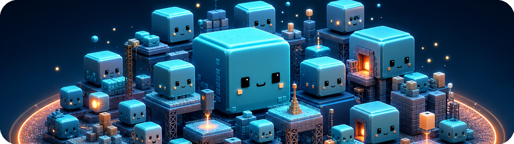
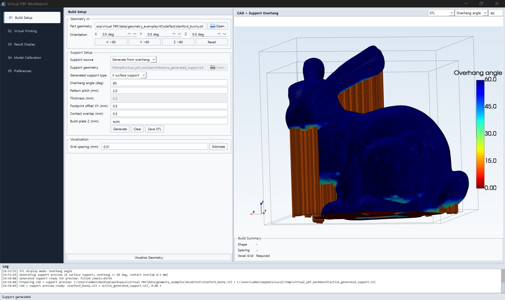
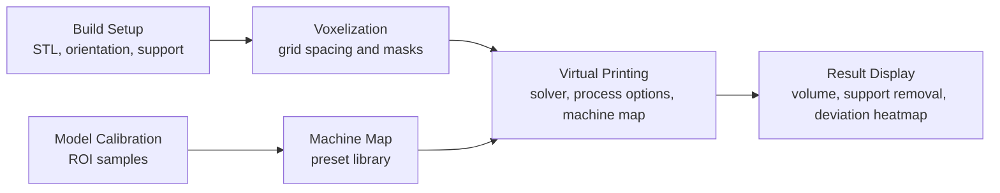
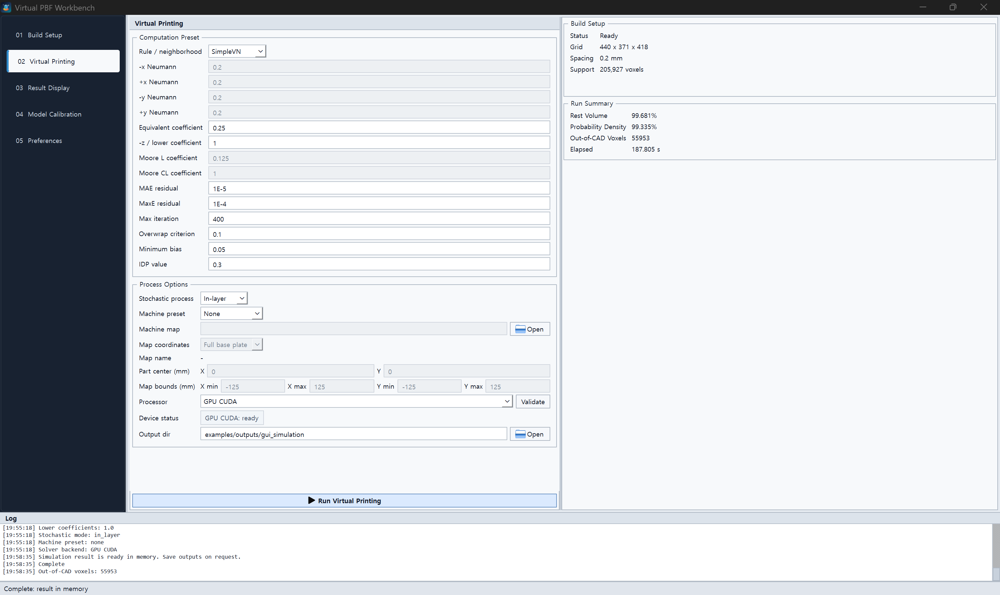
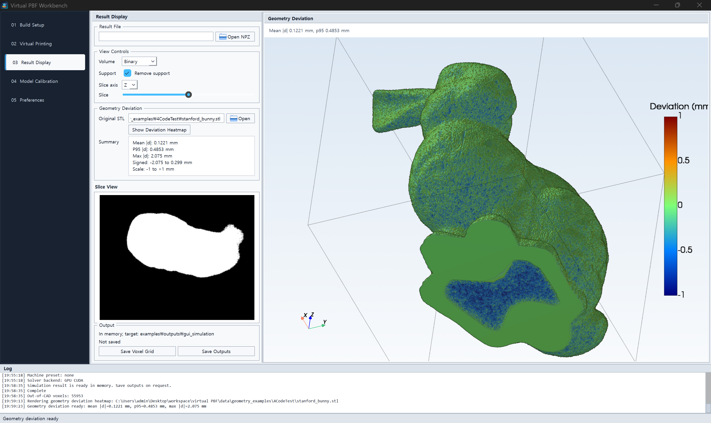

# Virtual PBF Workbench

<p align="center">
  
</p>

<p>
  
  
  
  
  
</p>

Virtual PBF Workbench is a desktop research application for fast, geometry-centered
virtual powder bed fusion studies. It is built for the practical loop of preparing a
build, generating or importing supports, voxelizing the setup, running an empirical
virtual printing model, inspecting the resulting volume, and calibrating model
parameters against reference regions of interest.

This is not a physics-based finite-element, thermal, melt-pool, fluid-flow, or residual
stress solver. It does not solve heat-transfer, phase-change, mechanics, or CFD
equations, and it does not require material properties, laser scan paths, beam profiles,
or transient temperature fields. Instead, it uses a calibrated stochastic voxel model:
local neighbor probabilities are propagated layer by layer through a build volume, then
sampled into a binary result that can be compared against geometry or calibration masks.

<p align="center">
  
</p>

<p align="center">
  <sub>Build Setup: STL orientation, overhang visualization, generated support, and voxelization controls.</sub>
</p>

## What It Does

- Loads STL part geometry, applies build orientation, and previews CAD geometry in 3D.
- Generates overhang-based supports or imports external support STL files.
- Keeps external support voxelization explicit with `Volume support` and `Line support`
  modes, because those paths are rasterized differently.
- Voxelizes the build setup before simulation so the print run starts from a known grid.
- Runs virtual PBF simulation with CPU reference, C++ native, or GPU CUDA backends.
- Applies machine parameter map presets as spatial solver inputs when selected.
- Displays simulation volumes, support-removed results, slices, and saved output state.
- Computes geometry deviation heatmaps against the original STL with a fixed +/-1 mm
  signed color scale.
- Runs ROI-based model calibration and saves reusable machine-map artifacts by preset
  name.

## Mathematical Model

The simulation core treats the voxelized build as a discrete 3D lattice. Each occupied
voxel carries a build probability, and each layer is updated from already-computed
neighbors rather than from continuum physics. The default update is a directional
Von Neumann neighborhood: four in-plane neighbors plus the lower-layer voxel below the
current cell.

At each layer, the solver iterates until the configured residual criteria or iteration
limit is reached. In simplified form, each voxel update combines:

- directional neighbor coefficients for `-X`, `+X`, `-Y`, and `+Y` growth tendency;
- a lower-layer coefficient for vertical propagation;
- a minimum bias term that can seed low-probability growth;
- an initial deviation parameter, `IDP`, which adjusts part voxels while being
  suppressed on support-only regions;
- stochastic sampling, either per layer or over the full volume, to produce the final
  binary geometry.

The model is therefore best understood as an empirical probabilistic morphology model.
It estimates how a voxelized target geometry may remain, disappear, or deviate under a
chosen parameter set. The coefficients are calibrated from observed geometry or ROI
masks, and machine maps can make those coefficients spatially varying across the build
plate.

### What It Is Not

Virtual PBF Workbench should not be interpreted as a direct physical simulation of the
PBF process. It does not predict temperature, melt-pool shape, fluid flow, thermal
stress, microstructure, powder spreading, or laser-material interaction. Its output is a
probability field, a sampled binary volume, geometric deviation metrics, and calibrated
parameter maps for fast comparative studies.

## Workbench Flow



## Screenshots

### Virtual Printing

Run the virtual PBF solver from the voxelized build. The simulation page keeps solver
parameters, stochastic process options, machine-map selection, backend validation, and
run summaries in one place.



### Result Display

Inspect the result volume, remove support from the displayed output, browse slices, and
compare the simulated result against the source STL with a signed geometry deviation
heatmap.



## Main Capabilities

| Area | Capability |
| --- | --- |
| Build setup | STL import, build orientation controls, overhang preview, support generation, external support import |
| Support handling | Generated X-surface, column, and volume supports; external line or volume support modes |
| Voxelization | Part/support mask generation with explicit grid spacing and 3D isosurface preview |
| Simulation | CPU reference, C++ native, and GPU CUDA backend selection with device validation |
| Machine maps | Preset discovery, coordinate modes, map preview, and spatial parameter application |
| Results | In-memory result display, NPZ/VTK saving on request, support removal in result views |
| Deviation | Original STL vs result isosurface comparison with signed heatmap and compact metrics |
| Calibration | ROI-based model calibration, parameter export, research artifacts, preset-scoped output |

## Repository Layout

```text
virtual PBF/
  README.md                 Project overview shown on GitHub
  DATA_MANIFEST.md          Included research data and omitted legacy files
  docs/images/              README screenshots
  app/
    launch_workbench.vbs    Windows no-console launcher
    launch_workbench.pyw    Python GUI launcher
    pyproject.toml          Package metadata and test configuration
    src/capp/
      workbench/            PySide6 UI and app orchestration
      geometry/             STL stats, mesh loading, support rasterization, voxelization
      solver/               CPU reference, native C++, and CUDA solver backends
      simulation/           Simulation pipeline and output writing
      calibration/          ROI losses and model calibration
      machine_map/          Machine-map fitting, metadata, export, and application
      io/                   NPZ and VTK helpers
    tests/                  Unit, workflow, backend, and UI helper tests
    docs/                   Architecture, development, native, and toolchain notes
  data/
    geometry_examples/      STL fixtures and calibration artifact geometry
    calibration_samples/    ROI target masks for Model Calibration
    machine_map/            SP coordinate workbook and portable CSV
    legacy_models/          Historical machine-model artifacts kept for reference
```

## Quick Start

Preferred local Windows launch:

```text
app/launch_workbench.vbs
```

Command-line launch from an existing workspace:

```powershell
cd "C:\Users\admin\Desktop\workspace\virtual PBF\app"
.\.venv\Scripts\python.exe launch_workbench.pyw
```

Fresh development environment:

```powershell
cd "C:\Users\admin\Desktop\workspace\virtual PBF\app"
py -3.11 -m venv .venv
.\.venv\Scripts\python.exe -m pip install --upgrade pip
.\.venv\Scripts\python.exe -m pip install -e ".[gui,dev]"
.\.venv\Scripts\python.exe launch_workbench.pyw
```

Optional native and GPU stacks can be installed when the local toolchain is available:

```powershell
.\.venv\Scripts\python.exe -m pip install -e ".[native,gpu]"
```

## Preset And Output Structure

Reusable calibration and machine-map artifacts are kept out of `examples/outputs`.
They live in a preset library keyed by the configured preset name:

```text
app/workbench_library/machine_presets/<preset_name>/
  calibration/
    model_calibration_weights.csv
    run_configuration.json
    research_artifacts/
  map/
    machine_parameter_map.npz
    machine_parameter_map.json
    machine_parameter_grid.csv
    machine_parameter_samples.csv
    run_configuration.json
    inputs/
```

Simulation outputs are saved only when requested from Result Display. The default target
is:

```text
app/examples/outputs/gui_simulation/
```

Generated workbench libraries, output folders, caches, and virtual environments are
ignored by git.

## Data Inputs

The repository includes portable data needed for the current workflow:

```text
data/geometry_examples/
data/calibration_samples/
data/machine_map/sp_coordinates.xlsx
data/machine_map/sp_coordinates.csv
data/legacy_models/
```

See `DATA_MANIFEST.md` for a concise list of included data.

## Development

Run checks from `app/`:

```powershell
cd "C:\Users\admin\Desktop\workspace\virtual PBF\app"
.\.venv\Scripts\python.exe -m ruff check .
.\.venv\Scripts\python.exe -m pytest -q
```

Current local status:

```text
141 passed
```

The test suite covers CLI behavior, voxelization, support handling, model calibration,
machine-map generation/application, backend validation, solver parity, and workbench UI
helpers.

## References

- Lee, Seung Yeop, et al. "Rapid prediction of dross formation and surface roughness
  using a stochastic CA model in L-PBF." *Engineering with Computers* 42.1 (2026): 29.

## License

This project is released under the MIT License. See `LICENSE` for the full
license text.

## Project Status

This is an active research workbench, not a generic demo. The GUI workflow is built
around the practical loop of preparing a build, running virtual printing, inspecting
result geometry, calibrating model parameters, and reusing machine-map presets.
